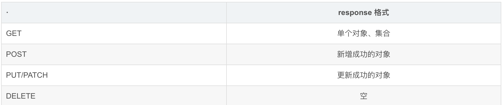

# Restful 规范

### 发展背景

网络应用程序，分为前端和后端两个部分。当前的发展趋势，就是前端设备层出不穷（手机、平板、桌面电脑、其他专用设备…）。因此，必须有一种统一的机制，方便不同的前端设备与后端进行通信。这导致API构架的流行，甚至出现"APIFirst"的设计思想。RESTful API是目前比较成熟的一套互联网应用程序的API设计理论。

REST（Representational State Transfer）表述性状态转换，REST指的是一组架构约束条件和原则。 如果一个架构符合REST的约束条件和原则，我们就称它为RESTful架构。REST本身并没有创造新的技术、组件或服务，而隐藏在RESTful背后的理念就是使用Web的现有特征和能力， 更好地使用现有Web标准中的一些准则和约束。虽然REST本身受Web技术的影响很深， 但是理论上REST架构风格并不是绑定在HTTP上，只不过目前HTTP是唯一与REST相关的实例

**关键**: 是面对现有的网络应用程序的交互方式,设计出来的一种规范,帮助我们更好的管理交互连接.

达到,见名知义,快速定义的问题.

### 应用

#### URI规范

get put post delete

#### 安全性和幂等性

#### 0-1

**1.涉及的链路**

前端http请求调用→后端接收

2.**涉及的资源**

前端,各种请求方式的请求头,体. 如,ContentType这些

后端,返回前台的格式,返回体是什么样的,返回码有什么要求,涉及什么规范

3.**实践过程中可能出现的问题**

**对错误的处理**

1. 不要发生了错误但给2xx响应，客户端可能会缓存成功的http请求；
2. 正确设置http状态码，不要自定义；
3. Response body 提供 1) 错误的代码（日志/问题追查）；2) 错误的描述文本（展示给用户）。

对第三点的实现稍微多说一点：

Java 服务器端一般用异常表示 RESTful API 的错误。API 可能抛出两类异常：业务异常和非业务异常。业务异常由自己的业务代码抛出，表示一个用例的前置条件不满足、业务规则冲突等，比如参数校验不通过、权限校验失败。非业务类异常表示不在预期内的问题，通常由类库、框架抛出，或由于自己的代码逻辑错误导致，比如数据库连接失败、空指针异常、除0错误等等。

业务类异常必须提供2种信息：

如果抛出该类异常，HTTP 响应状态码应该设成什么；
异常的文本描述；
在Controller层使用统一的异常拦截器：

设置 HTTP 响应状态码：对业务类异常，用它指定的 HTTP code；对非业务类异常，统一500；
Response Body 的错误码：异常类名
Response Body 的错误描述：对业务类异常，用它指定的错误文本；对非业务类异常，线上可以统一文案如“服务器端错误，请稍后再试”，开发或测试环境中用异常的 stacktrace，服务器端提供该行为的开关。

**api的演进**

常见的三种方式：

1.在uri中放版本信息：GET /v1/users/1  
2.Accept Header：Accept: application/json+v1  
3.自定义 Header：X-Api-Version: 1

URI失效  
随着系统发展，总有一些API失效或者迁移，对失效的API，返回404 not found 或 410 gone；对迁移的API，返回 301 重定向。

